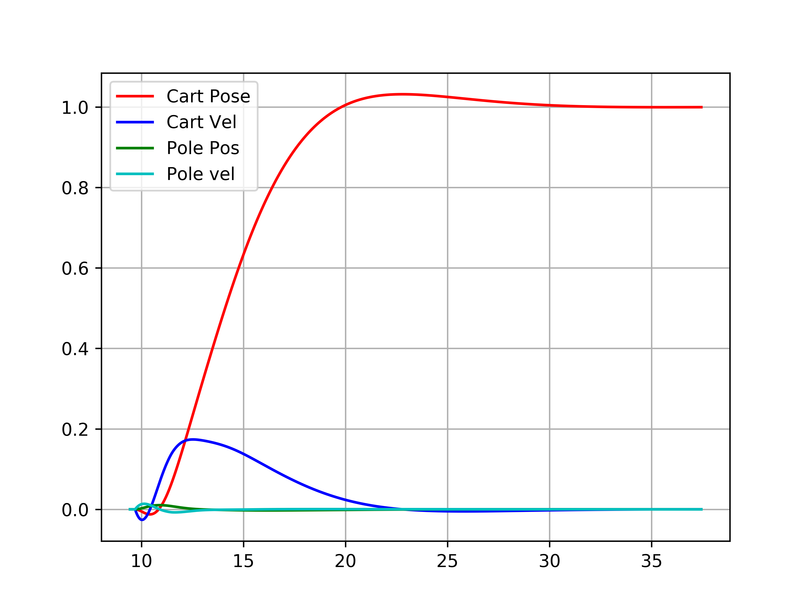

# Inverted Pendulum LQR control

## Launch gazebo model using 
roslaunch invpend_control load_invpend.launch

## PID
### PID controller parameter tuning 
Operate rqt_reconfigure to modify PID values
launch rqt_reconfigure with the following command

`rosrun rqt_reconfigure rqt_reconfigure`

### Demo: Inbuilt PID controller

## LQR control
'controllqr.py' in 'invpend_control/src' is to be run to execute LQR control.

Goal is set to

`[[1],[0],[0],[0]]`

### Video Using local PID controller

